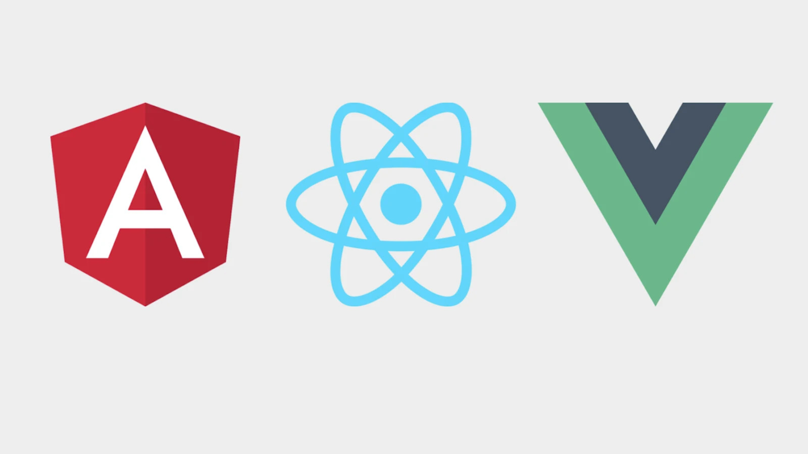

# Integration with Angular, React and Vue frameworks

DHTMLX Event Calendar is compatible with **Angular**, **React** and **Vue** frameworks. Refer to the corresponding [**Examples on CodeSandbox**](https://codesandbox.io/u/DHTMLX) for more information.
